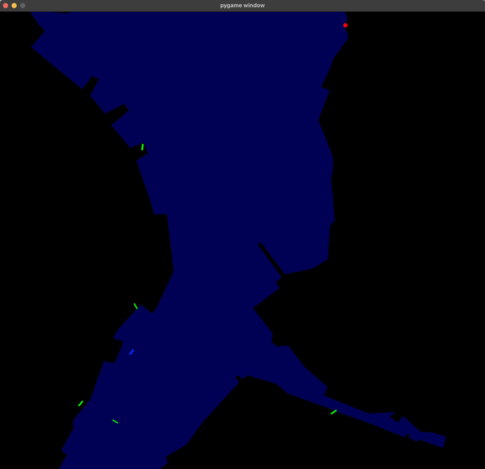

# FerryGym

A gym environment to simulate a ferry traversing the Kiel fjord.

## Description

This environment should simulate a ferry agent navigating in the Kiel fjord.
The goal is to reach a target location while staying on the fjord and avoiding collisions with other ships.



### Action space

The ferry can accelerate (or brake) and turn its heading.
Acceleration is measured in m/s^2, and and limited to physical possible values.
Turning is measured in degree.

### Observation space

The observation space is a dictionary containing the following keys: - `agent_position`: A 2D vector representing the position of the agent in environment coordinates. - `agent_direction`: A floating point value representing the direction the agent is facing in degrees. - `agent_speed`: A floating point value representing the speed of the agent. - `target`: A 2D vector representing the position of the target in latitude and longitude coordinates. - `neighborhood`: A 3D array of unsigned integers with a shape of (NEIGHBORHOOD_SIZE, NEIGHBORHOOD_SIZE, 3) representing the agent's local environment. - `agent_starting_position`: A 2D vector representing the starting position of the agent in latitude and longitude coordinates.
NOTE: This environment can be used to generate the training set for the [PPUU](https://github.com/Atcold/pytorch-PPUU) algorithm. Use the 'generate_training_data' flag to enable this mode. This will save a new pandas dataset with an additional column containing the path to a file containing the neighborhood for each ship and timestep.

### Episode termination

The episode ends if one of the following occurs: 1. Termination: the agent reaches the target. 2. The agent is out of the fjord. 3. The agent collides with another ship. 4. If a dataset of ship trajectories is provided, the dataset is exhausted.

### Rewards

The agent receives the following rewards: - running: if nothing happens, the agent receives a default reward of 0. - dataset_exhausted: if the provided dataset is exhausted, the agent receives a default reward of 0. - success: if the agent reaches the target, it receives a default reward of 100. - collision: if the agent collides with another ship, it receives a default reward of -100. - out_of_bounds: if the agent leaves the fjord, it receives a default reward of -100.

### Start and target position

The starting state is the ferry dock Reventlue (N54°19.961' E10°09.190 | 54.332683, 10.153167), the target is the ferry dock Moenkeberg (N54°21.117' E10°10.587' | 54.351950, 10.176450)

## Installation

### Prerequisites

- Python 3.11
- [Poetry](https://python-poetry.org/)

```bash
git clone
cd FerryGym
poetry install
poetry run python ./ferrygym/play-env.py
```

## Notes

- Poetery fails to instal jupyter since it is failing to install debugpy. (At least on my machine)
  Workaround: `poetry config installer.modern-installation false` see [issue](https://github.com/microsoft/debugpy/issues/1187) and [workaround](https://github.com/microsoft/debugpy/issues/1246#issuecomment-1476767234)
